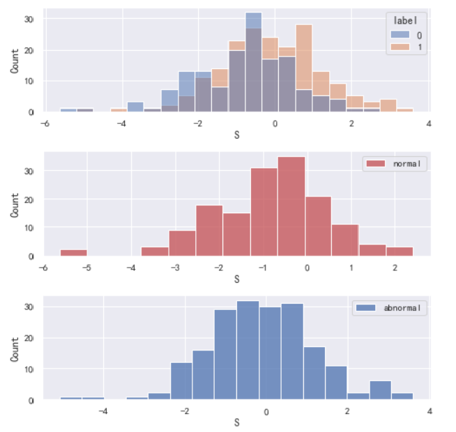
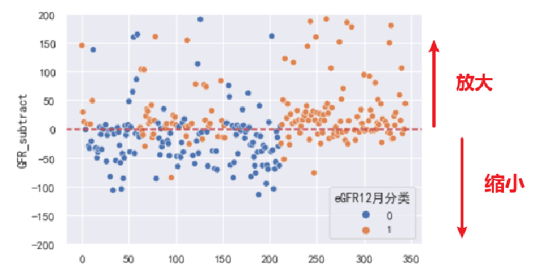
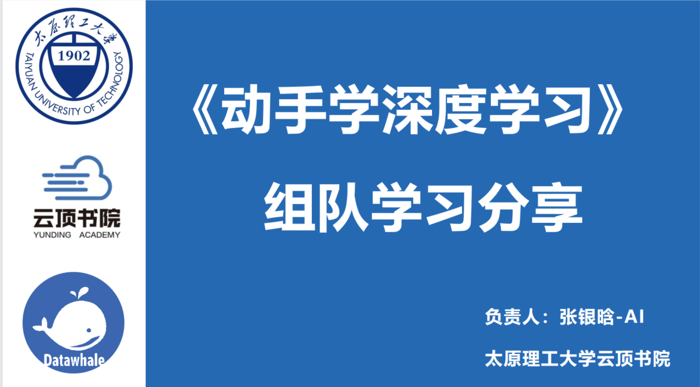
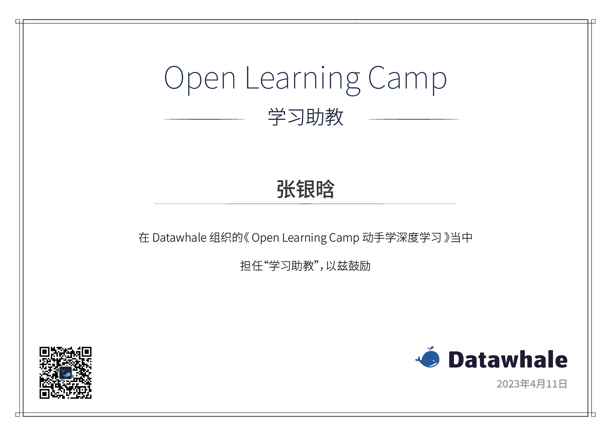

## Personal Statement:

>  I share your curiosity and love for hands-on experimentation. Open-source contributions are important to me, and I find great satisfaction in collaborating with teams. Effective communication and self-motivation are skills that I value and continually work on improving. I take pleasure in writing elegant code and have a keen interest in applying AI algorithms to real-world business scenarios. My approach is driven by a strong passion for learning and discovery, which has led me to gain experience in scientific research, industry practices, and open-source projects. 

# Publications:

## **《Survival analysis of patients with liver cirrhosis based on deep learning to quantify body composition》**

- Liver International (under review)

**Abstract:**

> Early body composition analysis in patients with liver cirrhosis is important for correcting malnutrition and improving prognosis and quality of life. Severe muscle wasting or Sarcopenia is the most common and often undetected complication, with serious negative effects on survival and quality of life. The purpose of this study was to use deep learning methods to segment and quantify body composition, and to determine Skeletal muscle reduced Visceral Obesity ( SVO ) by Skeletal Muscle Index ( SMI ) and Visceral to Subcutaneous adipose tissue Ratio ( VSR ) to examine its relationship with survival in patients with cirrhosis. In this paper, a new segmentation framework MCAUnet based on deep learning is proposed. The framework adds an attention mechanism from the perspective of the channel, which can adaptively fuse enough channel features to facilitate complex medical image segmentation. Compared with the previous segmentation model, the effect is optimal ( Dice = 0.952 ). We analyzed 117 adult patients with cirrhosis who were admitted to Shanxi Bethune Hospital between January 2016 and December 2020. SOV was defined as Sarcopenia ( male SMI <43.24 cm2 / m2, female SMI < 35.11 cm2 / m2 ) and visceral obesity ( male VSR ≥ 1.07, female VSR ≥0.68 ). 18.8 % of the subjects met the SOV criteria. Through survival analysis, the 3-year and 5-year survival rates of SVO patients were significantly lower than those of normal patients ( 32 % VS50 %, 5 % VS32 % ) [ P = 0.035 ]. In regression analysis, SVO was associated with mortality in patients with cirrhosis ( hazard ratio 0.54,95 % confidence interval 0.3-0.97 ), and still significant after multiple regression analysis ( hazard ratio 0.62,95 % confidence interval 0.31-1.3 ). Overall, SVO is associated with reduced survival in patients with cirrhosis, and further prospective studies and studies in other populations are needed to evaluate the model and the actual predictive effect of SVO.

**K** **E** **Y** **W** **O** **R** **D** **S**

Cirrhosis, Body Composition, Skeletal muscle reduced Visceral Obesity

**CONCLUSION**

> In summary, this study shows that the presence of L3 layer SVO determined by CT images of patients with cirrhosis can be used to predict OS in patients with cirrhosis. Furthermore, compared with other criteria used in previous studies ( MELD score and total body fat content ), the use of SVO to distinguish patients has higher reliability in predicting the overall survival of patients with cirrhosis. Surgeons should therefore pay more attention to the presence of patients with sarcopenic visceral obesity, which can help to personalize nutritional therapy promptly, reduce postoperative complications and improve the long-term prognosis of patients.

**Github Code Link:**  https://github.com/YinHan-Zhang/MCAUnet

------

# Project

## Surgical Data Ming

Backgroud

> Currently, there are over one million organ transplant recipients worldwide, with nearly 300,000 of them having received kidney transplants. In China, the number of kidney transplant recipients is close to 30,000. Kidney transplant involves transplanting a healthy kidney from a donor to a patient who has kidney disease and has lost kidney function. The human body has two kidneys, and when both kidneys lose function (bilateral kidney failure), kidney transplant is the most ideal treatment method.
>
> **eGFR** (estimated glomerular filtration rate) is an internationally recognized indicator that can effectively reflect the filtering function of the kidneys. A higher eGFR value indicates better kidney function. It is an important criterion for determining whether postoperative patients have abnormal kidney function.

**Current Research Pain Point 1:**

In terms of statistics, the use of generalized linear models to study variables is limited by covariance and collinearity, which can be explained but the results are not satisfactory.

**Current Research Pain Point 2:**

In terms of machine learning, the analysis of features is simple and relies on models, without in-depth exploration of data.

**Proposed Ideas:**

1. Use machine learning models to break free from linear constraints and study features.
2. Return to linear models for statistical interpretation.
3. Study data without relying on models.

**My Reselt:**

1. Obtained important factors that affect kidney transplant outcomes, constructed and selected 10 indicators. Two were existing original data (but overlooked by doctors) and eight were constructed as temporal features. **The model is simple, and all features passed statistical tests, making the model highly interpretable.**
2.  **Quantified the indicators.** Defined a formula to calculate the risk index and defined the risk index S to quantify the risk of postoperative recurrence.
3. **Interpreted the clinical significance of the risk index.** Studied the real-world significance of the gradient based on the defined formula and evaluated and optimized the calculation of the existing GFR formula.
4. **Validated the conclusion.** Calculated the risk index for all patients in the existing dataset of 345 and compared it with their original classification labels, demonstrating the role and significance of the risk index.

 

**Meaning:**

- By calculating the risk coefficient S, the GFR value can be optimized to reduce misjudgment, and the calculated risk coefficient S can be used to determine the risk trend.

## National Grid Power Data Mining

January 2021 to February 2021

**Project description**: 

Utilizing electricity consumption data from over 100 enterprise users provided by the National Grid company, analyze and identify potential suspected Bitcoin mining users. Design and select deep learning models.
**Main responsibilities:**

>1. Use SQL to clean and standardize daily data.
>2. Analyze user data, cluster users based on electricity consumption, and establish initial user profiles with five cluster labels.
>3. Utilize ensemble learning algorithms such as XGBoost and interpretable machine learning techniques to mine the data, preliminary selecting 15 suspected users.
>4. Model and forecast future electricity consumption for users using time series data. Built Informer and Dlinear algorithms for prediction, achieving an accuracy of 0.732.

##  Rhinoceros Bird Open Source Talent Development Program

2022.07 - 2022.09      Tencent Open Source Contributor

**Project description**: 

Adopting a university-industry dual mentorship model, based on Tencent's existing open-source project Angel, learning graph representation learning and some GNN algorithms under the guidance of mentors, and exploring research opportunities.

**Main responsibilities:**

>1. Under the guidance of the industry mentor, learn Hadoop, Spark, and algorithms related to graph representation learning.
>2. Deploy Tencent's high-performance machine learning platform Angel locally, develop the graph representation learning algorithm Struct2vec, and compare and analyze it with the classical DeepWalk and Node2vec algorithms. Achieved a 0.1 increase in average similarity within clusters for clustering and a 0.26 improvement in classification accuracy.

# Github Project

• I created this project to make the boring and difficult-to-understand algorithms of AI interesting, and to  

teach learners how to apply AI to real-life situations. 

• I am trying to combine GPT with robotics to do some fun things. 

Here is the Website link: http://ai.9998k.cn

github link :https://github.com/YinHan-Zhang/Mutual-AI

------

## InterShip

### **Zhiyuan Education Co., Ltd.**

Engineer, Shenzhen during the summer of 2022

**Work:**

During my internship, I will be using Raspberry Pi to create some small teaching demos, such as a simple facial recognition access control device and a mechanical arm sorting system for simulating a factory production line.

## **Dajin (China) Investment Co., Ltd.** 

Technical Research and Development, Control Algorithm Engineer, Shenzhen , April 2023 to May 2023

specializing in the technical research and development of smart home systems.

**Work:**

>1. Integrated various household appliances into the router terminal through HomeAssistance to real-time collect and retrieve data from all sensors.
>2. Process the collected data and develop logic control algorithms and prediction models to predict human activities and states in the environment. Automate the adjustment of environmental device parameters.

# Contest

**< The National College Student Internet+ Innovation and Entrepreneurship Competition >**

- National Second Prize 

**< The China Software Cup National College Student Software Design Competition >**

- National Second Prize 

**< The 2022 BDCI Competition's Criminal sentence reduction prediction >**

- 10th Place (10/482) 

**< The Chinese Robotics and Artificial Intelligence Competition >**

- National Third Prize.

**<  The National College Student Mathematical Modeling Competition >**

- The second prize in the Shanxi Province

----

# Volunteer Work With AI

**Hands-on Learning of Deep Learning, DataWhale  Course Assistant** 

• The DataWhale team I belong to contacted Professor Li Mu and organized the "Hands-on Deep Learning"  

course, attracted 9,027 students from 733 universities around the world to join the group for learning. 

• I was one of ths, helping and solving problems for students during the learning process. 

